

# Ask The World API

- [Requesting action links](#requesting-action-links)
- [Opening action links](#opening-action-links)
- [External services requests](#external-services-requests)
- [User registration and authentication](#user-registration-and-authentication)

## Requesting action links

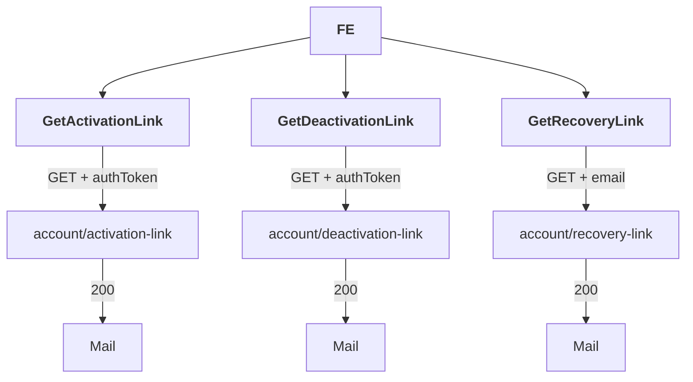

## Opening action links

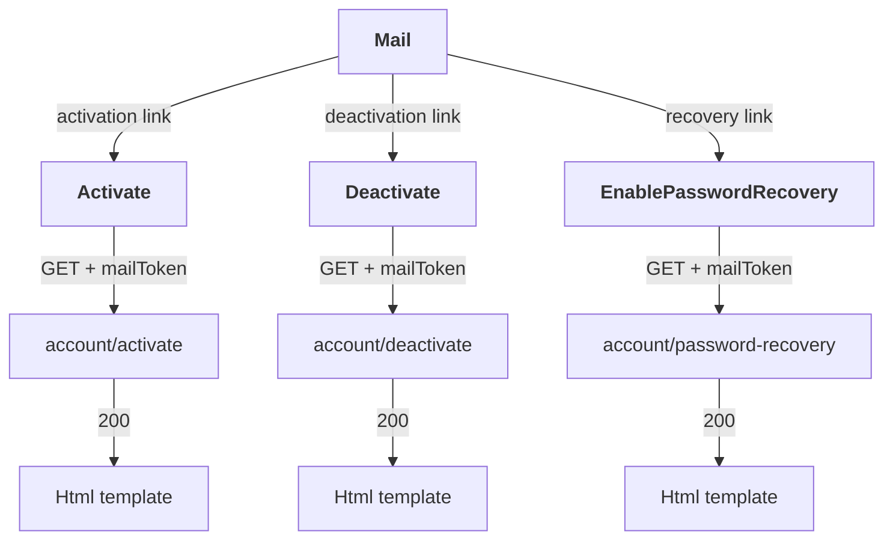

## External services requests

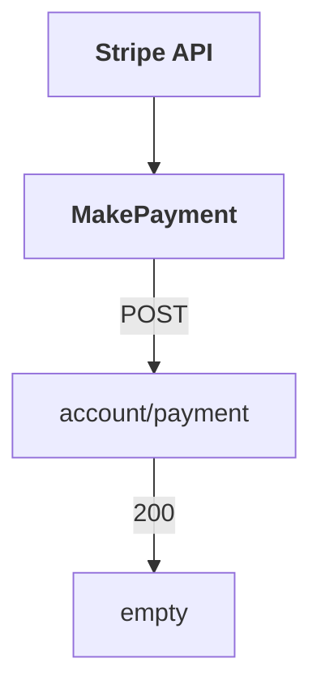

## User registration and authentication

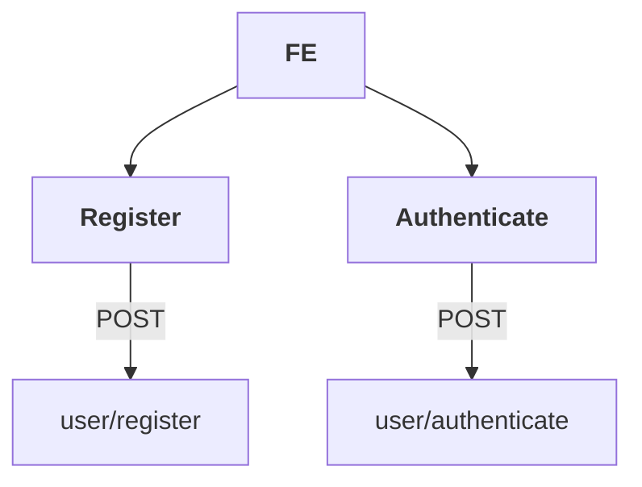

## Getting user(s) data

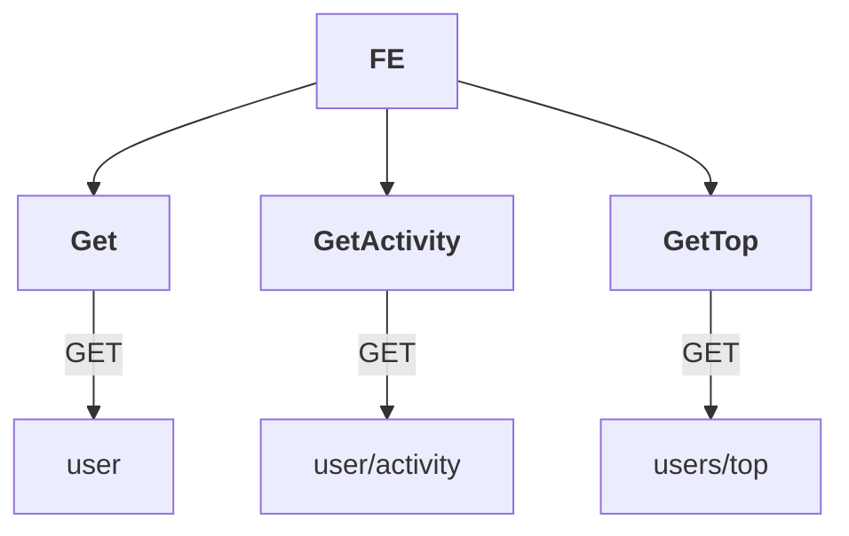

## Updating user

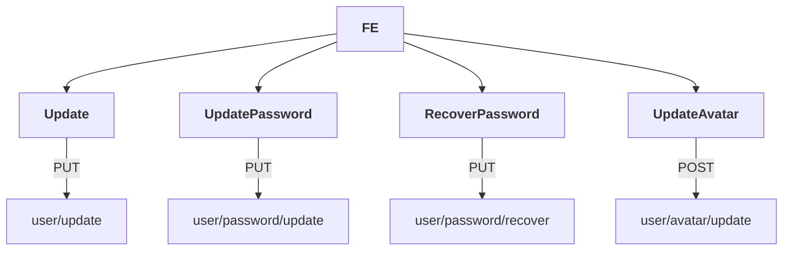

## List of questions

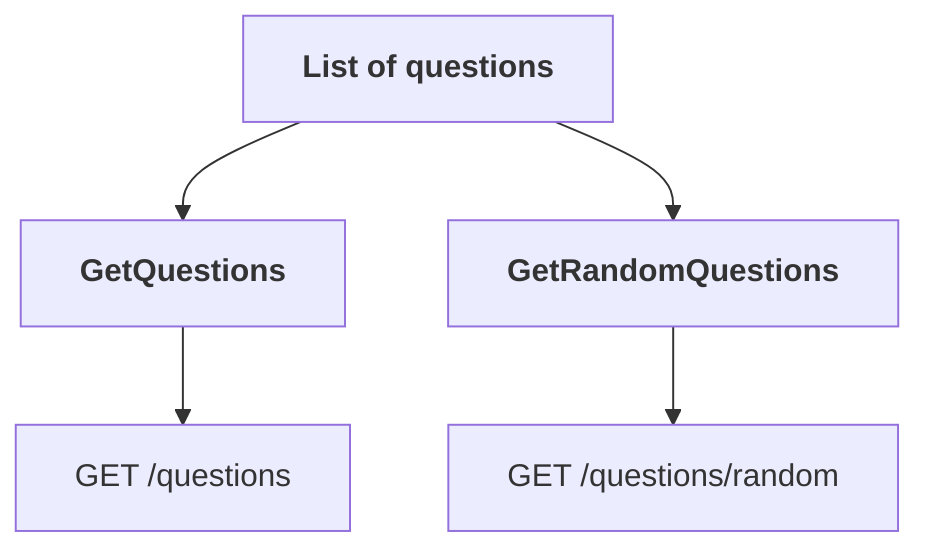

## Question

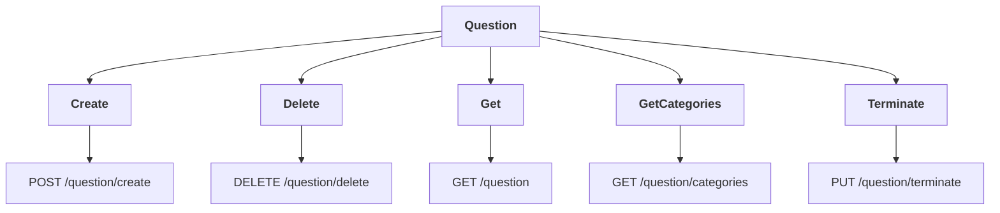

## Answer

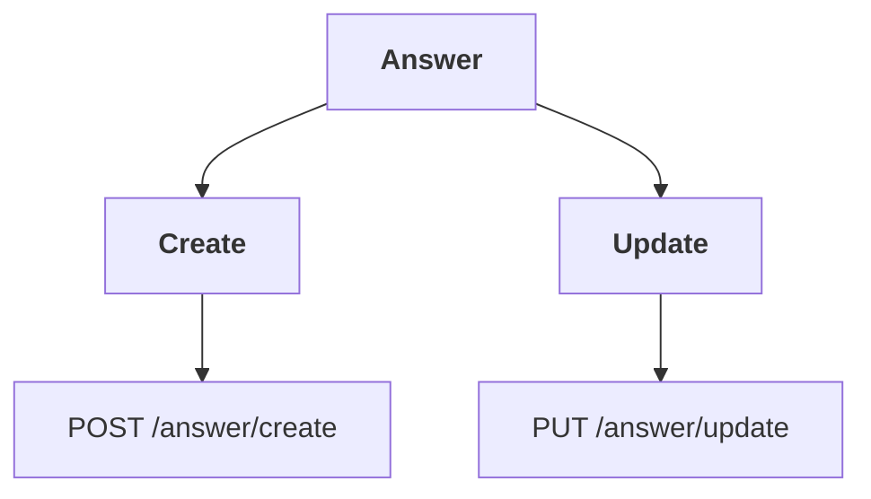

## Follow

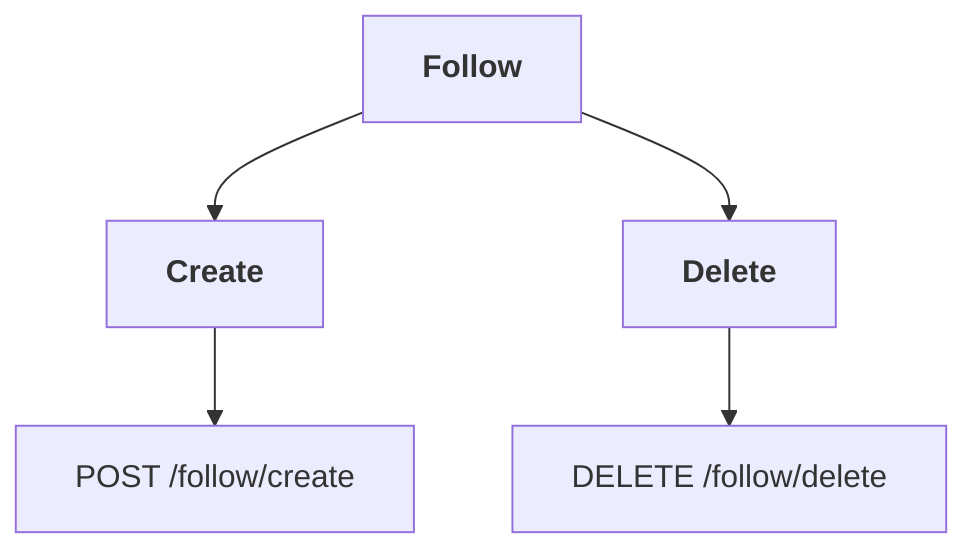

## Report

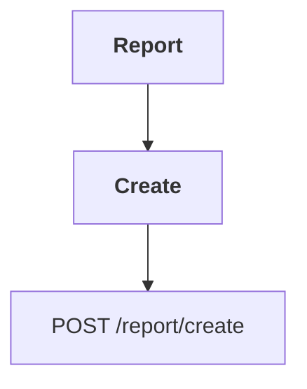

## Other

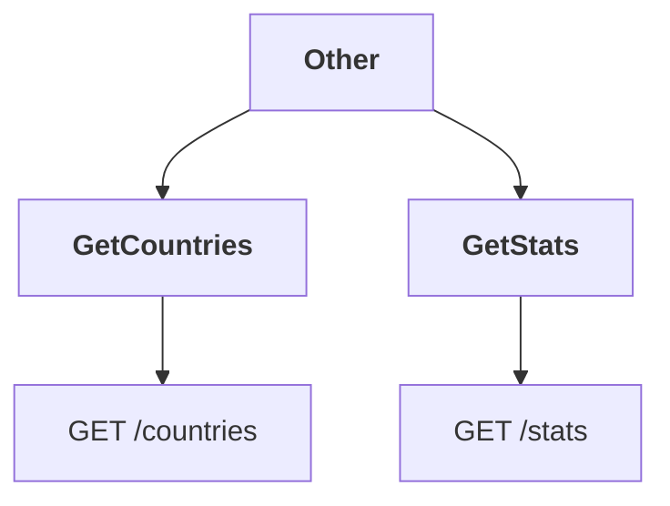
