

# Ask The World API

 

## Flows

- [Request action link](#request-action-link)
- [Open action link](#open-action-link)
- [External services requests](#external-services-requests)
- [User registration and authentication](#user-registration-and-authentication)
- [Getting user(s) data](#getting-users-data)
- [Updating user](#updating-user)
- [List of questions](#list-of-questions)
- [Question](#question)
- [Answer](#answer)
- [Follow](#follow)
- [Report](#report)
- [Other](#other)

 

## Request action link

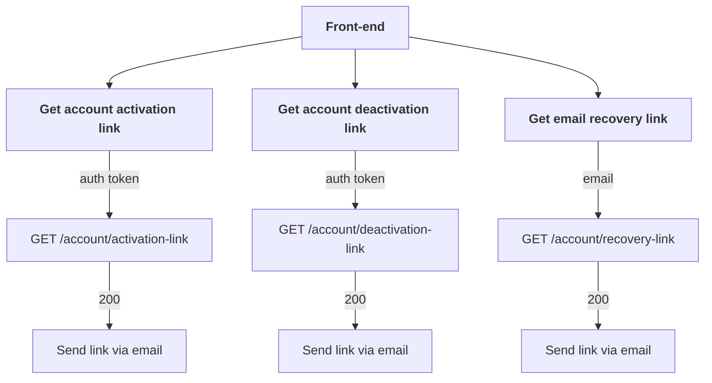

## Open action link

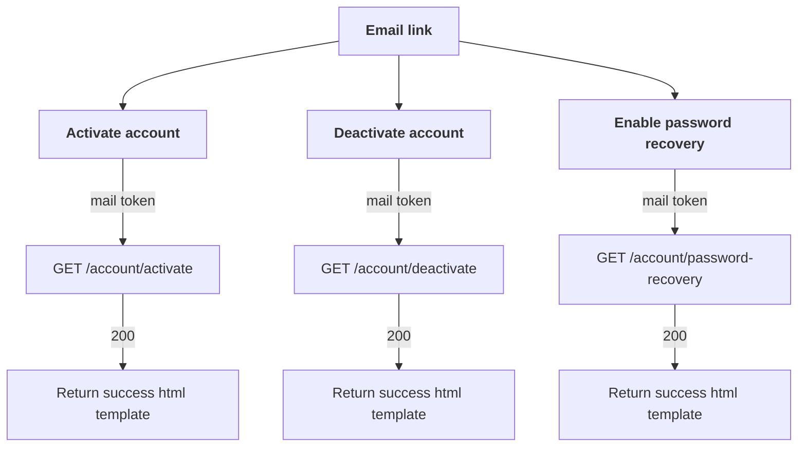

## External services requests

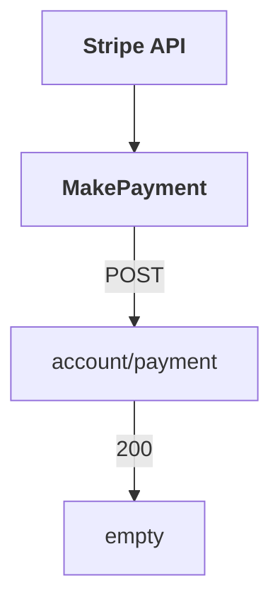

## User registration and authentication

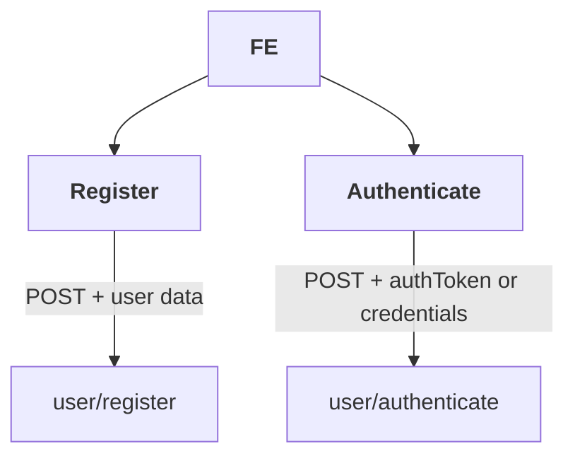

## Getting user(s) data

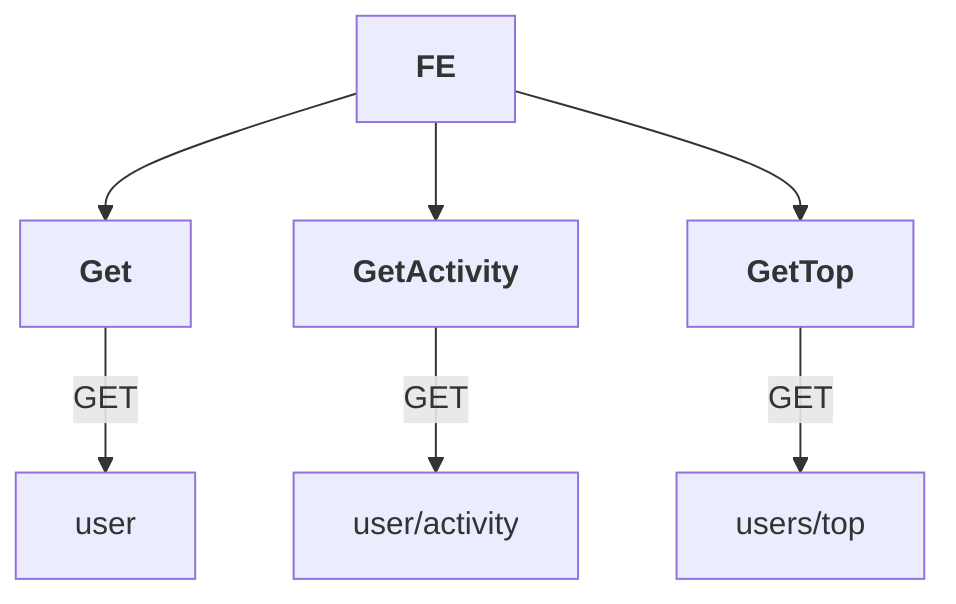

## Updating user

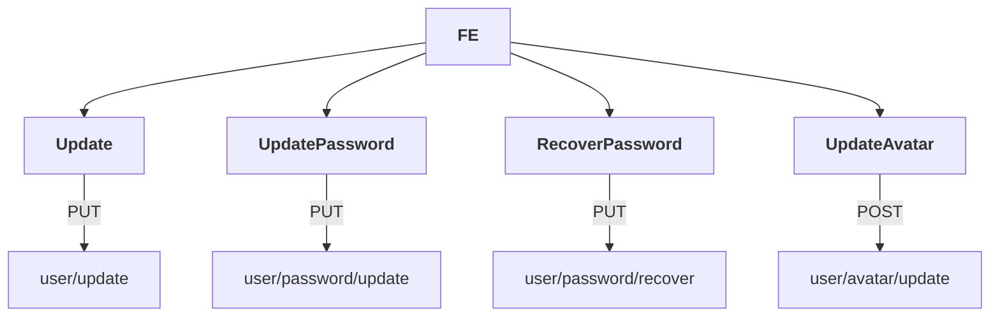

## List of questions

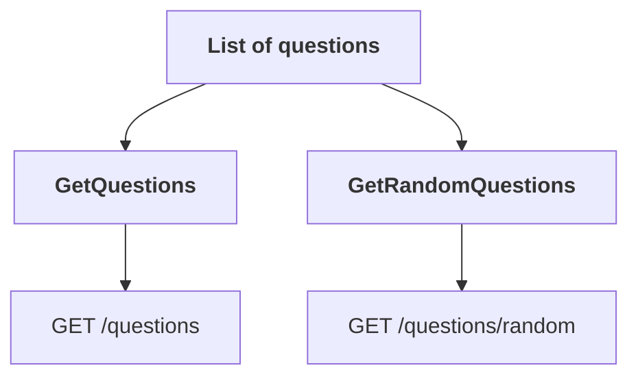

## Question

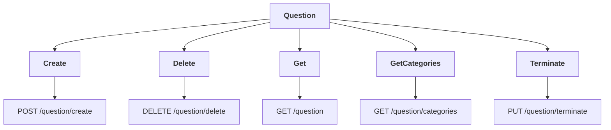

## Answer

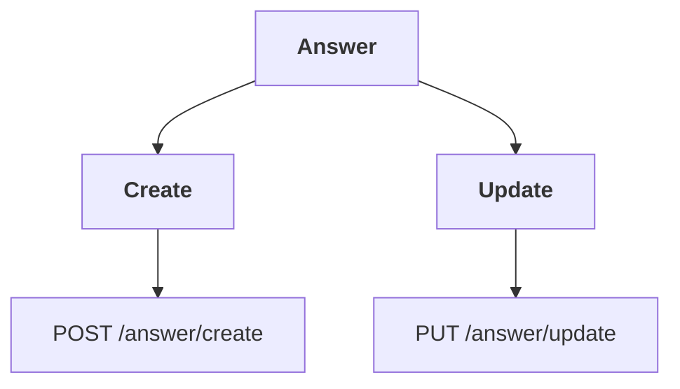

## Follow

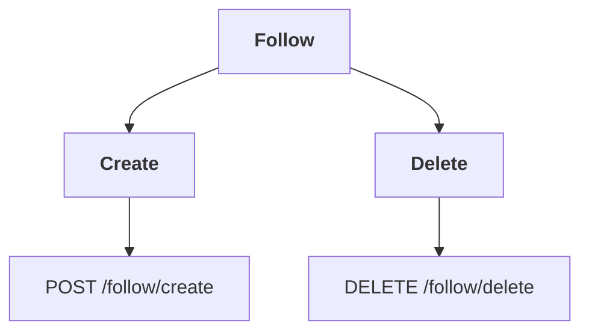

## Report

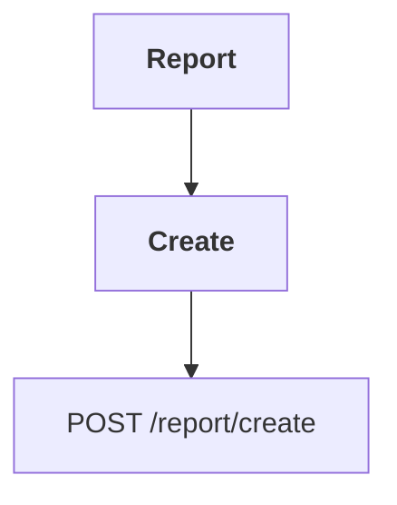

## Other

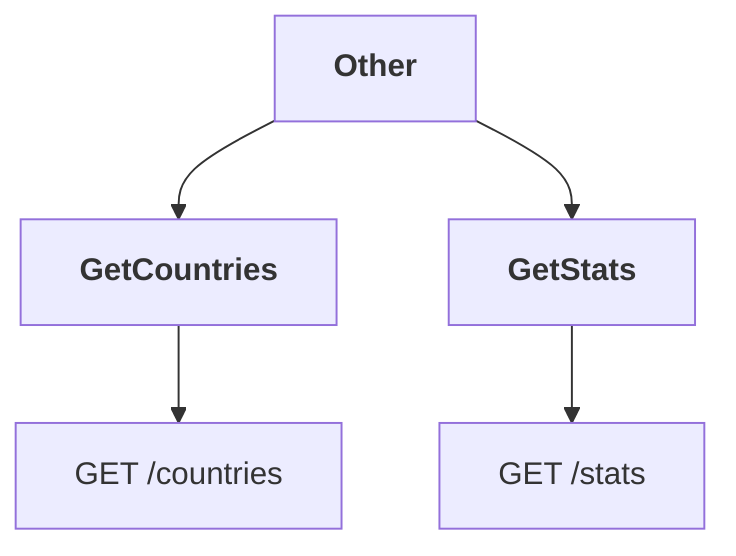
