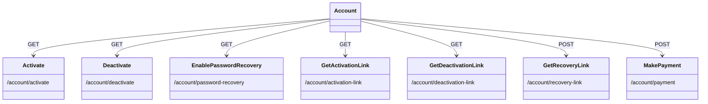
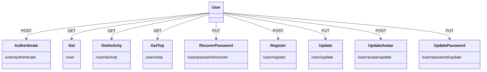

# Ask The World API

```mermaid
classDiagram
Account --> Activate : GET
Account --> Deactivate: GET
Account --> EnablePasswordRecovery : GET
Account --> GetActivationLink : GET
Account --> GetDeactivationLink : GET
Account --> GetRecoveryLink: POST
Account --> MakePayment: POST 
Activate: /account/activate
Deactivate: /account/deactivate
GetActivationLink: /account/activation-link
GetDeactivationLink: /account/deactivation-link
EnablePasswordRecovery: /account/password-recovery
GetRecoveryLink: /account/recovery-link
MakePayment: /account/payment
```

```mermaid
classDiagram
User --> Authenticate : POST
User --> Get: GET
User --> GetActivity : GET
User --> GetTop : GET
User --> RecoverPassword : PUT
User --> Register: POST
User --> Update: PUT
User --> UpdateAvatar: POST
User --> UpdatePassword: PUT
Authenticate: /user/authenticate
Get: /user
GetActivity: /user/activity
GetTop: /users/top
RecoverPassword: /user/password/recover
Register: /user/register
Update: /user/update
UpdateAvatar: /user/avatar/update
UpdatePassword: /user/password/update
```
