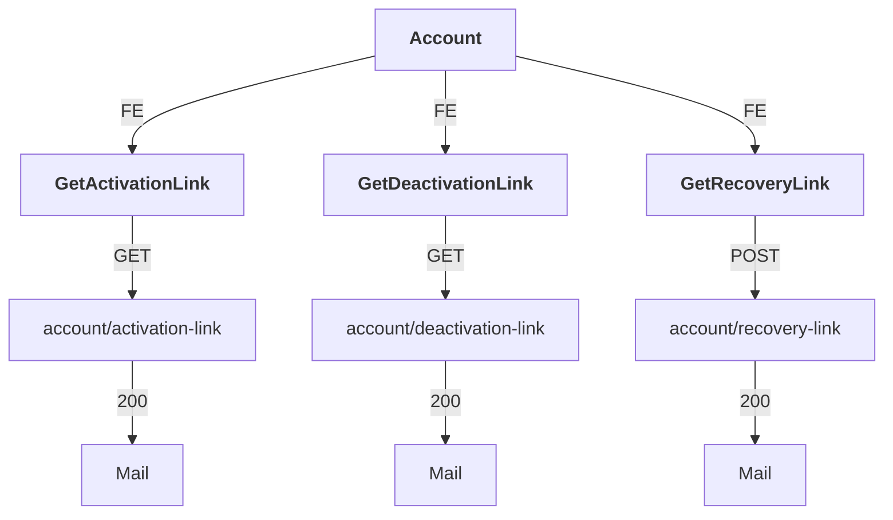
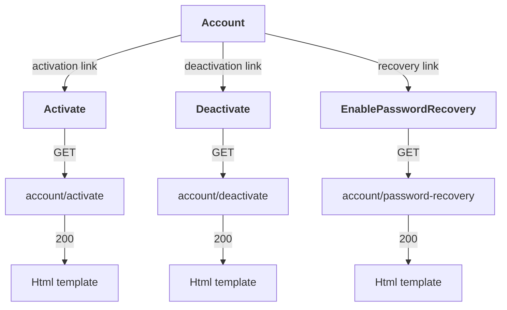
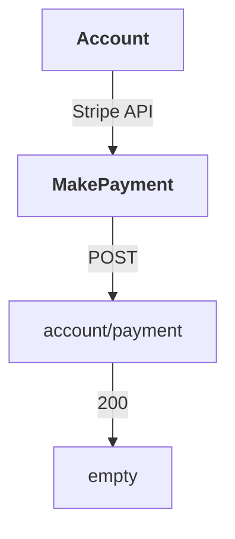

# Ask The World API

## Account (FE requests)

## Account (mail link requests)

## Account (external services requests)

## User

## List of questions

## Question

## Answer

## Follow

## Report

## Other

